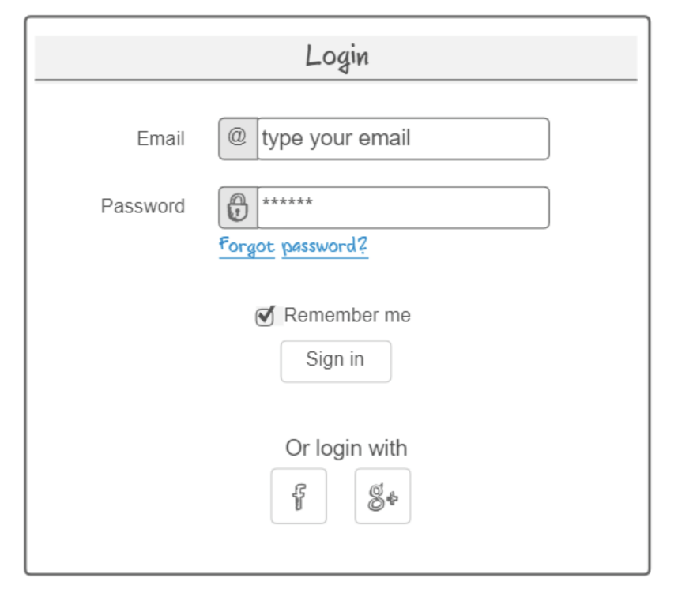
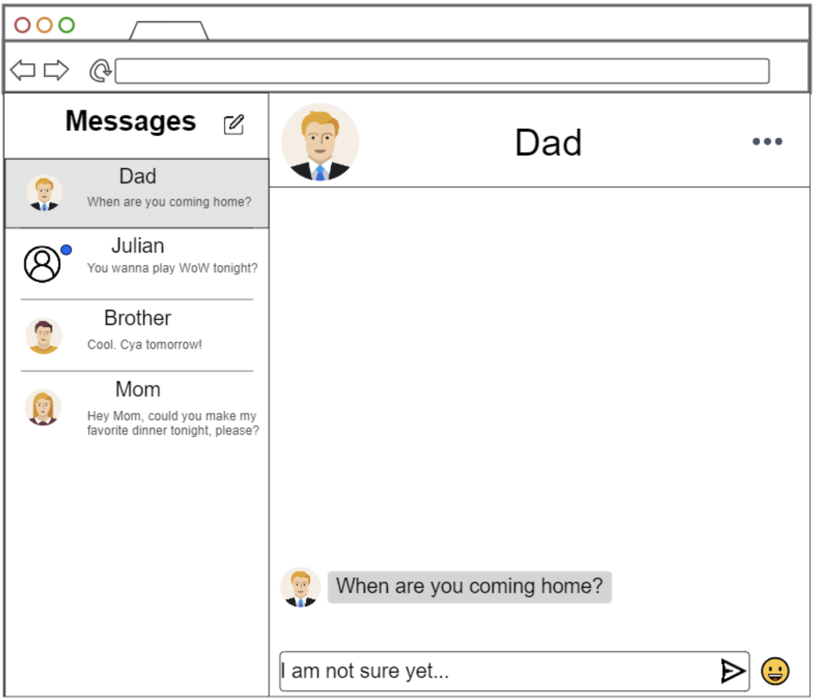

# WebChat 

## Specification Deliverable

### Elevator Pitch

Tired of the hassle of texting on your phone when you’re at work or in a meeting? WebChat lets you discreetly chat with friends and family straight from your web browser—no app needed, and totally free. With its intuitive design, staying connected has never been easier. 

### Design

### Key Features

- Secure login over HTTPS
- Ability to chat with other users
- Ability to have a profile picture
- Ability to use emojis
- Ability to see past messages
- Ability to have multiple conersations

### Technologies

I am going to use the required technologies in the following ways.

- **HTML** - Uses HTML structure for web application. There will be two HTML pages, one for login and one for chatting. 
- **CSS** - Application styling that will look good on different screen sizes, uses good whitespace, color choice and contrast.
- **JavaScript** - Provides login, choice for colors, sending and recieving messages, display other chats, choosing emojis, choosing profile picture, backend endpoint calls.
- **Service** - Backend service with endpoints for:
  - login
  - retrieving messages
  - sending messages
  - retrieving new message status
- **DB/Login** - Store users, profile pictures, and messages in database. Register and login users. Credentials securely stored in database. Can't send/view messages without authentication.
- **WebSocket** - As a user sends a message, their message is broadcasted to the designated user.
- **React** - Application ported to use the React web framework.