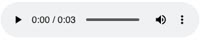
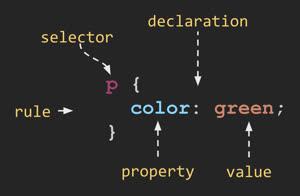
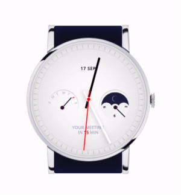

# Notes for CS 260

## Markdown Syntax

https://docs.github.com/en/get-started/writing-on-github/getting-started-with-writing-and-formatting-on-github/basic-writing-and-formatting-syntax

## Github
It is _very_ confusing, but luckily the repo for the class explains everything there is to know about it: https://github.com/webprogramming260/.github/blob/main/profile/essentials/gitHub/gitHub.md

## AWS
- Public IP for server = http://52.71.239.144
- ssh commands = ➜  ssh -i [key pair file] ubuntu@52.71.239.144
- GitHub = https://github.com/webprogramming260/.github/blob/main/profile/webServers/amazonWebServicesEc2/amazonWebServicesEc2.md

## Amazon Web Services - Route 53
https://github.com/webprogramming260/.github/blob/main/profile/webServers/amazonWebServicesRoute53/amazonWebServicesRoute53.md

## HTTPS, TLS, and web certificates
https://github.com/webprogramming260/.github/blob/main/profile/webServers/https/https.md

## Git Bash commands
The other primary purpose of the console is to execute commands. You already did this in the previous section when you executed commands for working with the file system. However, console commands can perform many different operations. Here are some basic commands that you show experiment with.

- **echo** - Output the parameters of the command
- **cd** - Change directory
- **mkdir** - Make directory
- **rmdir** - Remove directory
- **rm** - Remove file(s)
- **mv** - Move file(s)
- **cp** - Copy files
- **ls** - List files
- **curl** - Command line client URL browser
- **grep** - Regular expression search
- **find** - Find files
- **top** - View running processes with CPU and memory usage
- **df** - View disk statistics
- **cat** - Output the contents of a file
- **less** - Interactively output the contents of a file
- **wc** - Count the words in a file
- **ps** - View the currently running processes
- **kill** - Kill a currently running process
- **sudo** - Execute a command as a super user (admin)
- **ssh** - Create a secure shell on a remote computer
- **scp** - Securely copy files to a remote computer
- **history** - Show the history of commands
- **ping** - Check if a website is up
- **tracert** - Trace the connections to a website
- **dig** - Show the DNS information for a domain
- **man** - Look up a command in the manual

You can also chain the input and output of commands using special characters

- `|` - Take the output from the command on the left and _pipe_, or pass, it to the command on the right
- `>` - Redirect output to a file. Overwrites the file if it exists
- `>>` - Redirect output to a file. Appends if the file exists

For example, you can list the files in a directory, pipe it into `grep` to search for files created in Nov, and then pipe that into `wc` to count the number of files found with a date of Nov.

```
ls -l | grep ' Nov ' | wc -l
```

There are also keystrokes that have special meaning in the console.

- `CTRL-R` - Use type ahead to find previous commands
- `CTRL-C` - Kill the currently running command

### Assignment: output of "cat other.txt"

xxyy

## HTML
https://github.com/webprogramming260/.github/blob/main/profile/html/introduction/introduction.md

### Common elements

Modern HTML contains over 100 different elements. Here is a short list of HTML elements that you will commonly see.

| element   | meaning                                                                |
| --------- | ---------------------------------------------------------------------- |
| `html`    | The page container                                                     |
| `head`    | Header information                                                     |
| `title`   | Title of the page                                                      |
| `meta`    | Metadata for the page such as character set or viewport settings       |
| `script`  | JavaScript reference. Either a external reference, or inline           |
| `include` | External content reference                                             |
| `body`    | The entire content body of the page                                    |
| `header`  | Header of the main content                                             |
| `footer`  | Footer of the main content                                             |
| `nav`     | Navigational inputs                                                    |
| `main`    | Main content of the page                                               |
| `section` | A section of the main content                                          |
| `aside`   | Aside content from the main content                                    |
| `div`     | A block division of content                                            |
| `span`    | An inline span of content                                              |
| `h<1-9>`  | Text heading. From h1, the highest level, down to h9, the lowest level |
| `p`       | A paragraph of text                                                    |
| `b`       | Bring attention                                                        |
| `table`   | Table                                                                  |
| `tr`      | Table row                                                              |
| `th`      | Table header                                                           |
| `td`      | Table data                                                             |
| `ol,ul`   | Ordered or unordered list                                              |
| `li`      | List item                                                              |
| `a`       | Anchor the text to a hyperlink                                         |
| `img`     | Graphical image reference                                              |
| `dialog`  | Interactive component such as a confirmation                           |
| `form`    | A collection of user input                                             |
| `input`   | User input field                                                       |
| `audio`   | Audio content                                                          |
| `video`   | Video content                                                          |
| `svg`     | Scalable vector graphic content                                        |
| `iframe`  | Inline frame of another HTML page                                      |

### Comments

You can include comments in your HTML files by starting the comment with `<!--` and ending it with `-->`. Any text withing a comment block will be completely ignored when the browser renders it.

```html
<!-- commented text -->
```

### Special characters

HTML uses several reserved characters for defining its file format. If you want to use those characters in your content then you need to escape them using the `entity` syntax. For example, to display a less than symbol (`<`) you would instead use the less than entity (`&lt;`). You can also use the entity syntax to represent any unicode character.

| Character | Entity      |
| --------- | ----------- |
| &amp;     | `&amp;`     |
| <         | `&lt;`      |
| >         | `&gt;`      |
| "         | `&quot;`    |
| '         | `&apos;`    |
| &#128512; | `&#128512;` |

## HTML Structure

Repo: https://github.com/webprogramming260/.github/blob/main/profile/html/structure/structure.md

Assignment: https://codepen.io/Cyb3rDr4g0n/pen/vYqdvao

## HTML Input

| Element    | Meaning                          | Example                                        |
| ---------- | -------------------------------- | ---------------------------------------------- |
| `form`     | Input container and submission   | `<form action="form.html" method="post">`      |
| `fieldset` | Labeled input grouping           | `<fieldset> ... </fieldset>`                   |
| `input`    | Multiple types of user input     | `<input type="" />`                            |
| `select`   | Selection dropdown               | `<select><option>1</option></select>`          |
| `optgroup` | Grouped selection dropdown       | `<optgroup><option>1</option></optgroup>`      |
| `option`   | Selection option                 | `<option selected>option2</option>`            |
| `textarea` | Multiline text input             | `<textarea></textarea>`                        |
| `label`    | Individual input label           | `<label for="range">Range: </label>`           |
| `output`   | Output of input                  | `<output for="range">0</output>`               |
| `meter`    | Display value with a known range | `<meter min="0" max="100" value="50"></meter>` |

## Form element

The main purpose of the `form` element is to submit the values of the inputs it contains. Before JavaScript was introduced the `form` container element was essential because it was the only way for the browser to send the input data to a web server as part of a request to process the input and generate a new web page displaying the result of the input. With JavaScript we have much more control over input data and what is done with it. For example, in a single page application the JavaScript will dynamically rebuild the HTML elements to reflect the results of the user interaction. With this ability the data may not even be sent to the server. This greatly reduces the necessity of the `form` element, but it is often still used simply as a container. Just remember that you are not required to have a form element to use input elements.

Here is an example of a simple form that submits the value of a `textarea` element.

```html
<form action="submission.html" method="post">
  <label for="ta">TextArea: </label>
  <textarea id="ta" name="ta-id">
Some text
  </textarea>
  <button type="submit">Submit</button>
</form>
```

Pressing the submit button sends the following data to the web server. The browser generates the data by combining the textarea's `name` attribute with the current value of the textarea.

```
ta-id=Some+text
```

## Input element

From the very early days of HTML it contained elements for accepting the input of user data. These elements include the following:

| Element    | Meaning                          | Example                                        |
| ---------- | -------------------------------- | ---------------------------------------------- |
| `form`     | Input container and submission   | `<form action="form.html" method="post">`      |
| `fieldset` | Labeled input grouping           | `<fieldset> ... </fieldset>`                   |
| `input`    | Multiple types of user input     | `<input type="" />`                            |
| `select`   | Selection dropdown               | `<select><option>1</option></select>`          |
| `optgroup` | Grouped selection dropdown       | `<optgroup><option>1</option></optgroup>`      |
| `option`   | Selection option                 | `<option selected>option2</option>`            |
| `textarea` | Multiline text input             | `<textarea></textarea>`                        |
| `label`    | Individual input label           | `<label for="range">Range: </label>`           |
| `output`   | Output of input                  | `<output for="range">0</output>`               |
| `meter`    | Display value with a known range | `<meter min="0" max="100" value="50"></meter>` |

The input element represents many different input types. You set the type of input with the `type` attribute. There are several different types to choose from. This includes different flavors of textual, numeric, date, and color inputs.

| Type           | Meaning                           |
| -------------- | --------------------------------- |
| text           | Single line textual value         |
| password       | Obscured password                 |
| email          | Email address                     |
| tel            | Telephone number                  |
| url            | URL address                       |
| number         | Numerical value                   |
| checkbox       | Inclusive selection               |
| radio          | Exclusive selection               |
| range          | Range limited number              |
| date           | Year, month, day                  |
| datetime-local | Date and time                     |
| month          | Year, month                       |
| week           | Week of year                      |
| color          | Color                             |
| file           | Local file                        |
| submit         | button to trigger form submission |

In order to create an input you specify the desired `type` attribute along with any other attribute associated with that specific input. Here is an example of a checked radio button and its associated label.

```html
<label for="checkbox1">Check me</label> <input type="checkbox" name="varCheckbox" value="checkbox1" checked />
```

Most input elements share some common attributes. These include the following.

| Attribute | Meaning                                                                             |
| --------- | ----------------------------------------------------------------------------------- |
| name      | The name of the input. This is submitted as the name of the input if used in a form |
| disabled  | Disables the ability for the user to interact with the input                        |
| value     | The initial value of the input                                                      |
| required  | Signifies that a value is required in order to be valid                             |

The following shows what the inputs look like when rendered. Don't worry about how clunky they look right out of the box. We will fix that when we start styling things with CSS.


### Assignment

https://codepen.io/Cyb3rDr4g0n/pen/RwzQvpR

- <span style="color:red">**NOT READY TO TURN IN!!!** </span>
- **DEFAULT COLOR IS NOT TURNING RED**

## HTML Media

The HTML elements that represent media include `img`, `audio`, `video`, `svg`, and `canvas`. The `img`, `audio`, and `video` elements are all simple references to an external file, but `svg` and `canvas` both contain the code to render a visual image that can even be animated.

### External media

The media tags that reference external media all take a URL as an attribute. The path represented by the URL can either be a relative path or full path. A full path includes the protocol, domain name, and path to the file.

```html
https://images.pexels.com/photos/164170/pexels-photo-164170.jpeg
```

A relative path references a file that is served from the same location as the HTML page rendering the element. You want to make the path as relative as possible so that you can move your code around without having to actually adjust all of the external page references. For example, if your HTML page is located in a directory with a subdirectory named `images` that contains a file named `photo.jpg` you would use a relative path as follows.

```html
images/photo.jpg
```

### Image

To include an image in your content you use the `img` element and specify the `src` attribute with the URL to the source image.
In order to support accessibility, you should also include an `alt` attribute that describes the image. A full img element would look like the following.

```html

```


### Audio

To include an audio file in your content you use the `audio` element and specify the `src` attribute with the URL to the source audio file. You can include the `controls` attribute if you want the user to be able to control the audio playback. If you do not display the controls then there is no visual representation of the audio in the rendered page. The `autoplay` attribute starts the audio playing as soon as the audio file is loaded, and the `loop` attribute keeps it playing over and over.

⚠ Note that automatically playing audio is strongly discouraged unless you provide a way for the user to opt-in to that behavior.

```html
<audio controls src="testAudio.mp3"></audio>
```



### Video

To include a video in your content you use the `video` element and specify the `src` attribute with the URL to the source video. Like the audio element you can include the `controls` or `autoplay` attributes.

⚠ Note that you may need to include the `crossorigin="anonymous"` attribute if you are requesting files from a different domain than the one serving your content.

```html
<video controls width="300" crossorigin="anonymous">
  <source src="https://commondatastorage.googleapis.com/gtv-videos-bucket/sample/BigBuckBunny.mp4" />
</video>
```


## Internal media

The internal media elements `svg` and `canvas` allow you to actually create images directly within your HTML.

### Scalable Vector Graphics (SVG)

SVG is an extremely powerful and widely supported way to render graphics inline in your HTML. An example SVG graphic that draws a black border and a red circle looks like this:

```html
<svg viewBox="0 0 300 200" xmlns="http://www.w3.org/2000/svg" stroke="red" fill="red" style="border: 1px solid #000000">
  <circle cx="150" cy="100" r="50" />
</svg>
```


When combined with JavaScript and CSS you can produce some amazing visualizations. Checkout this [CodePen](https://codepen.io/leesjensen/pen/mdKjMLY) for an example.

Consult the [MDN documentation](https://developer.mozilla.org/en-US/docs/Web/SVG) if you are interested in learning more about SVG.

### Canvas

The `canvas` element was introduced to HTML in order to facilitate 2D drawing and animation. The HTML for the canvas element is fairly simple, but actually drawing on the canvas requires JavaScript support. Here again, is our simple red dot example.

```html
<canvas id="canvasDemo" width="300" height="200" style="border: 1px solid #000000"></canvas>
<script>
  const ctx = document.getElementById('canvasDemo').getContext('2d');
  ctx.beginPath();
  ctx.arc(150, 100, 50, 0, 2 * Math.PI);
  ctx.fillStyle = 'red';
  ctx.strokeStyle = 'red';
  ctx.fill();
  ctx.stroke();
</script>
```

### Assignment

https://codepen.io/Cyb3rDr4g0n/pen/zYVWWoG

## CSS Intro

Functionally, CSS is primarily concerned with defining `rulesets`, or simply `rules`. A rule is comprised of a `selector` that selects the elements to apply the rule to, and one or more `declarations` that represent the `property` to style with the given `property value`.



For example, consider the following rule.

```css
p {
  font-family: sans-serif;
  font-size: 2em;
  color: navy;
  text-shadow: 3px 3px 1px #cccccc;
}
```

The selector `p` selects all paragraph elements in the HTML document. The four specified declarations then: 1) change the font to use a sans-serif font, 2) increase the font size to be twice as big as the default font, 3) change the text color to be navy, and 4) create a gray shadow for the text. The result looks like this.


### Associating CSS with HTML

There are three ways that you can associate CSS with HTML. The first way is to use the `style` attribute of an HTML element and explicitly assign one or more declarations.

```html
<p style="color:green">CSS</p>
```

The next way to associate CSS is to use the HTML `style` element to define CSS rules within the HTML document. The `style` element should appear in the `head` element of the document so that the rules apply to all elements of the document.

```html
<head>
  <style>
    p {
      color: green;
    }
  </style>
</head>
<body>
  <p>CSS</p>
</body>
```

The final way to associate CSS is to use the HTML `link` element to create a hyperlink reference to an external file containing CSS rules. The `link` element must appear in the `head` element of the document.

```html
<link rel="stylesheet" href="styles.css" />
```

**styles.css**

```css
p {
  color: green;
}
```

All of the above examples are equivalent, but using the `link` element usually is the preferred way to define CSS.

### Cascading styles

Because elements inherit the rules applied to their parents you often end up with the same declaration property applied to a single element multiple times. For example, we might set color property for all `body` elements to be red, and then `paragraph` elements to be green, and then `span` elements to be blue, and finally use a style element on a specific `span` to be black.

```html
<body>
  <p><span style="color:black">CSS</span></p>
</body>
```

```css
body {
  color: red;
}
p {
  color: green;
}
span {
  color: blue;
}
```

In this case, the rules cascade down from the highest nodes in the DOM tree to the lowest level. Any declaration property defined at a lower level will override the higher declaration. You can see this happening if you use the browser's debugger. In Chrome right click on the element and select `inspect`. You can then click on each element in the debugger and see what the value of the color property is. For the case defined above you will see that each of the higher level declarations is crossed out until you get to the style explicitly defined on the element.


### The box model

CSS defines everything as boxes. When you apply styles, you are applying them to a region of the display that is a rectangular box. Within an element's box there are several internal boxes. The innermost box holds the element's content. This is where things like the text or image of an element is displayed. Next comes the padding. The padding will inherit things like the background color. After padding is the border, which has properties like color, thickness and line style. The final box is the margin. The margin is considered external to the actual styling of the box and therefore only represents whitespace. It is important to understand each of these boxes so that you can achieve the desired visual result by applying the proper CSS declaration.


By default, the width and height of an element is defined by the width and height of the content box. You can change the `box-sizing` CSS property from the default value of `content-box` to `border-box` in order to redefine the width and height to also include the padding and the border. This often makes it easier to style elements when their visual size matches their actual size.

## CSS Selectors

The first step in understanding CSS is mastering how to select the elements that a CSS rule applies to. The CSS rule selector can take many forms. In order to explain the most common selectors we need some demonstration HTML. Let's image a simple document describing the departments in a university. In our case we have a physics and a chemistry department. The information provided is very sparse, but the structure provided by the HTML is enough to work with.

```html
<body>
  <h1>Departments</h1>
  <p>welcome message</p>
  <section id="physics">
    <h2>Physics</h2>
    <p class="introduction">Introduction</p>
    <p>Text</p>
    <p class="summary">Summary</p>
  </section>
  <section id="chemistry">
    <h2>Chemistry</h2>
    <p class="introduction">Introduction</p>
    <p>Text</p>
    <p class="summary">Summary</p>
  </section>
</body>
```

By default every browser defines a base set of styles that it applies to all HTML. This varies slightly from browser to browser, but for the most part our document would render like this using the base browser styles.


We would like to style our document so that it looks like this when we are done.


### Element type selector

To start things off, we want to make all elements in the document use a sans-serif font. We can do this by using an element name selector. By selecting the `body` element we will cascade our declaration down to all the children of the body, which is the whole document.

```css
body {
  font-family: sans-serif;
}
```

Note that we could also use the wildcard element name selector (`*`) to select all elements, but for our needs the `body` element will work just fine.

We can also use element name selectors to give a bottom border to the top level heading (`h1`), as well as modify the section elements to pop out with a gray background and some white space in the padding and margins.

```css
h1 {
  border-bottom: thin black solid;
}

section {
  background: #eeeeee;
  padding: 0.25em;
  margin-bottom: 0.5em;
}
```

### Combinators

Next we want to change the color of the second level headings (`h2`), but we only want to do that within the sections for each department. To make that happen we can provide a `descendant combinator` that is defined with a space delimited list of values where each item in the list is a descendant of the previous item. So our selector would be all `h2` elements that are descendants of `section` elements.

```css
section h2 {
  color: #004400;
}
```

There are other types of combinators that you can use. These include the following.

| Combinator       | Meaning                    | Example        | Description                                |
| ---------------- | -------------------------- | -------------- | ------------------------------------------ |
| Descendant       | A list of descendants      | `body section` | Any section that is a descendant of a body |
| Child            | A list of direct children  | `section > p`  | Any p that is a direct child of a section  |
| General sibling  | A list of siblings         | `div ~ p`      | Any p that has a div sibling               |
| Adjacent sibling | A list of adjacent sibling | `div + p`      | Any p that has an adjacent div sibling     |

We can use the general sibling combinator to increase the whitespace padding on the left of paragraphs that are siblings of a level two heading.

```css
h2 ~ p {
  padding-left: 0.5em;
}
```

### Class selector

The next selector we will use is the class selector. Remember that any element can have zero or more classifications applied to it. For example, our document has a class of `introduction` applied to the first paragraph, and a class of `summary` applied to the final paragraph of each section. If we want to bold the summary paragraphs we would supply the class name summary prefixed with a period (`.summary`).

```css
.summary {
  font-weight: bold;
}
```

You can also combine the element name and class selectors to select all paragraphs with a class of summary.

```css
p.summary {
  font-weight: bold;
}
```

### ID selector

ID selectors reference the ID of an element. All IDs should be unique within an HTML document and so this select targets a specific element. To use the ID selector you prefix the ID with the hash symbol (`#`). We would like to showcase our physics department by putting a thin purple border along the left side of the physics section.

```css
#physics {
  border-left: solid 1em purple;
}
```

### Attribute selector

Attribute selectors allow you to select elements based upon their attributes. You use an attribute selector to select any element with a given attribute (`a[href]`). You can also specify a required value for an attribute (`a[href="./fish.png"]`) in order for the selector to match. Attribute selectors also support wildcards such as the ability to select attribute values containing specific text (`p[href*="https://"]`).

```css
p[class='summary'] {
  color: red;
}
```

For a full description of attribute selections refer to [MDN](https://developer.mozilla.org/en-US/docs/Web/CSS/Attribute_selectors).

### Pseudo selector

CSS also defines a significant list of pseudo selectors which select based on positional relationships, mouse interactions, hyperlink visitation states, and attributes. We will give just one example. Suppose we want our purple highlight bar to appear only when the mouse hovers over the text. To accomplish this we can change our ID selector to select whenever a section is hovered over.

```css
section:hover {
  border-left: solid 1em purple;
}
```

You can find out more about pseudo selectors on [MDN](https://developer.mozilla.org/en-US/docs/Web/CSS/Pseudo-classes).

## CSS Declarations

📖 **Deeper dive reading**: [MDN reference section on properties](https://developer.mozilla.org/en-US/docs/Web/CSS/Reference)

CSS rule declarations specify a property and value to assign when the rule selector matches one or more elements. There are legions of possible properties defined for modifying the style of an HTML document. For our purposes we will discuss just a few of the more commonly used ones so that you can get a feel for wide variety of functionality they represent.

| Property           | Value                              | Example             | Discussion                                                                     |
| ------------------ | ---------------------------------- | ------------------- | ------------------------------------------------------------------------------ |
| background-color   | color                              | `red`               | Fill the background color                                                      |
| border             | color width style                  | `#fad solid medium` | Sets the border using shorthand where any or all of the values may be provided |
| border-radius      | unit                               | `50%`               | The size of the border radius                                                  |
| box-shadow         | x-offset y-offset blu-radius color | `2px 2px 2px gray`  | Creates a shadow                                                               |
| columns            | number                             | `3`                 | Number of textual columns                                                      |
| column-rule        | color width style                  | `solid thin black`  | Sets the border used between columns using border shorthand                    |
| color              | color                              | `rgb(128, 0, 0)`    | Sets the text color                                                            |
| cursor             | type                               | `grab`              | Sets the cursor to display when hovering over the element                      |
| display            | type                               | `none`              | Defines how to display the element and its children                            |
| filter             | filter-function                    | `grayscale(30%)`    | Applies a visual filter                                                        |
| float              | direction                          | `right`             | Places the element to the left or right in the flow                            |
| flex               |                                    |                     | Flex layout. Used for responsive design                                        |
| font               | family size style                  | `Arial 1.2em bold`  | Defines the text font using shorthand                                          |
| grid               |                                    |                     | Grid layout. Used for responsive design                                        |
| height             | unit                               | `.25em`             | Sets the height of the box                                                     |
| margin             | unit                               | `5px 5px 0 0`       | Sets the margin spacing                                                        |
| max-[width/height] | unit                               | `20%`               | Restricts the width or height to no more than the unit                         |
| min-[width/height] | unit                               | `10vh`              | Restricts the width or height to no less than the unit                         |
| opacity            | number                             | `.9`                | Sets how opaque the element is                                                 |
| overflow           | [visible/hidden/scroll/auto]       | `scroll`            | Defines what happens when the content does not fix in its box                  |
| position           | [static/relative/absolute/sticky]  | `absolute`          | Defines how the element is positioned in the document                          |
| padding            | unit                               | `1em 2em`           | Sets the padding spacing                                                       |
| left               | unit                               | `10rem`             | The horizontal value of a positioned element                                   |
| text-align         | [start/end/center/justify]         | `end`               | Defines how the text is aligned in the element                                 |
| top                | unit                               | `50px`              | The vertical value of a positioned element                                     |
| transform          | transform-function                 | `rotate(0.5turn)`   | Applies a transformation to the element                                        |
| width              | unit                               | `25vmin`            | Sets the width of the box                                                      |
| z-index            | number                             | `100`               | Controls the positioning of the element on the z axis                          |

### Units

📖 **Deeper dive reading**: [MDN Values and units](https://developer.mozilla.org/en-US/docs/Learn/CSS/Building_blocks/Values_and_units)

You can use a variety of units when defining the size of a CSS property. For example, the width of an element can be defined using absolute units such as the number of pixels (`px`) or inches (`in`). You can also use relative units such as a percentage of the parent element (`50%`), a percentage of a minimum viewport dimension (`25vmin`), or a multiplier of the size of the letter m (`1.5rem`) as defined by the root element.

```css
p {
  width: 25%;
  height: 30vh;
}
```

Here is a list of the most commonly used units. All of the units are prefixed with a number when used as a property value.

| Unit | Description                                                      |
| ---- | ---------------------------------------------------------------- |
| px   | The number of pixels                                             |
| pt   | The number of points (1/72 of an inch)                           |
| in   | The number of inches                                             |
| cm   | The number of centimeters                                        |
| %    | A percentage of the parent element                               |
| em   | A multiplier of the width of the letter `m` in the parent's font |
| rem  | A multiplier of the width of the letter `m` in the root's font   |
| ex   | A multiplier of the height of the element's font                 |
| vw   | A percentage of the viewport's width                             |
| vh   | A percentage of the viewport's height                            |
| vmin | A percentage of the viewport's smaller dimension                 |
| vmax | A percentage of the viewport's larger dimension                  |

### Color

📖 **Deeper dive reading**: [MDN Applying color](https://developer.mozilla.org/en-US/docs/Web/CSS/CSS_Colors/Applying_color)

CSS defines multiple ways to describe color, ranging from representations familiar to programmers and ones familiar to layout designers and artists.

| Method       | Example                   | Description                                                                                                                                                                                                       |
| ------------ | ------------------------- | ----------------------------------------------------------------------------------------------------------------------------------------------------------------------------------------------------------------- |
| keyword      | `red`                     | A set of predefined colors (e.g. white, cornflowerblue, darkslateblue)                                                                                                                                            |
| RGB hex      | `#00FFAA22` or `#0FA2`    | Red, green, and blue as a hexadecimal number, with an optional alpha opacity                                                                                                                                      |
| RGB function | `rgb(128, 255, 128, 0.5)` | Red, green, and blue as a percentage or number between 0 and 255, with an optional alpha opacity percentage                                                                                                       |
| HSL          | `hsl(180, 30%, 90%, 0.5)` | Hue, saturation, and light, with an optional opacity percentage. Hue is the position on the 365 degree color wheel (red is 0 and 255). Saturation is how gray the color is, and light is how bright the color is. |

## CSS Fonts

📖 **Deeper dive reading**: [MDN Web fonts](https://developer.mozilla.org/en-US/docs/Learn/CSS/Styling_text/Web_fonts)

Choosing appropriate fonts is a key web application design characteristic. A beautiful modern font will make your application enjoyable to use. Picking a hard to read font, an overused font, or using too many fonts will turn users away.

The CSS `font-family` property defines what fonts should be used. The property value represents an ordered list of fonts. The first font in the list that is available will be used. This ability to select from a list of fonts is important because different operating systems have different default fonts and your first choice may not be available.

### Font families

There are four major families of fonts: `Serif`, `sans-serif`, `fixed`, and `symbol`. A serif is a small stroke attached to the ends of a character's major strokes. Serif fonts have the extra strokes; sans-serif fonts do not. Fixed fonts characters all are the same size. This is useful for lining up text when doing things like coding or displaying tabular data. Symbol fonts represent non-language characters such as arrows or emojis.

### Importing fonts

In addition to referencing standard fonts found on the user's computer you can specify a font that you provide with your application. That way your application is guaranteed to always look the same. In order to have the browser load a font you use the `@font-face` rule and provide the font name and source location.

```css
@font-face {
  font-family: 'Quicksand';
  src: url('https://cs260.click/fonts/quicksand.ttf');
}

p {
  font-family: Quicksand;
}
```

If you do not want to host font files on your server, then you can load them from a font provider. For example, Google provides a large selection of [open source fonts](https://fonts.google.com/) that you can use without paying any royalties. The easiest way to use Google fonts is to use a CSS import statement to reference the Google Font Service. This will automatically generate the CSS for importing the font.

```css
@import url('https://fonts.googleapis.com/css2?family=Rubik Microbe&display=swap');

p {
  font-family: 'Rubik Microbe';
}
```

## CSS Animation

📖 **Deeper dive reading**: [MDN Animation](https://developer.mozilla.org/en-US/docs/Web/CSS/CSS_Animations/Using_CSS_animations)

Using CSS to animate your components is an easy way to make your application feel alive and interactive. You create CSS animations using the `animation` properties and defining `keyframes` for what the element should look like at different times in the animation. Let's walk through an example.

We have a paragraph of centered text and we want it to zoom in until its size is 20% of the view height.

```css
p {
  text-align: center;
  font-size: 20vh;
}
```

To make this happen we specify that we are animating the selected elements by adding the `animation-name` property with a value of demo. This name refers to the name of the `keyframes` that we will specify in a minute. The keyframes tell what CSS properites should be applied at different key points in the animation sequence. We also add an `animation-duration` property in order to specify that the animation should last for three seconds.

```css
p {
  text-align: center;
  font-size: 20vh;

  animation-name: demo;
  animation-duration: 3s;
}
```

Now we are ready to create the keyframes. We don't have to define what happens at every millisecond of the animation. Instead we only need to define the key points, and CSS will generate a smooth transition to move from one keyframe to another. In our case we simply want to start with text that is invisible and have it zoom into the full final size. We can do this with two frames that are designated with the keywords `from` and `to`.

```css
@keyframes demo {
  from {
    font-size: 0vh;
  }

  to {
    font-size: 20vh;
  }
}
```

That's everything we need to do. However, let's make one more addition. It would look better if towards the end, the paragraph bounced out a little bigger than its final size. We can accommodate that by adding another key frame that happens 95 percent through the animation.

```css
@keyframes demo {
  from {
    font-size: 0vh;
  }

  95% {
    font-size: 21vh;
  }

  to {
    font-size: 20vh;
  }
}
```


You can see this animation working with this [CodePen](https://codepen.io/leesjensen/pen/LYrJEwX).

Animation is not just for pushing buttons or making text float around. Here is an example of [animating a watch](https://codepen.io/leesjensen/pen/MWBjXNq) using only HTML and CSS.



CodePen has a lot of CSS animation examples that you can experiment with. Here is a simple one with [floating clouds](https://codepen.io/leesjensen/pen/wvXEaRq) that I found interesting. If you find an interesting one share it with us on Discord.